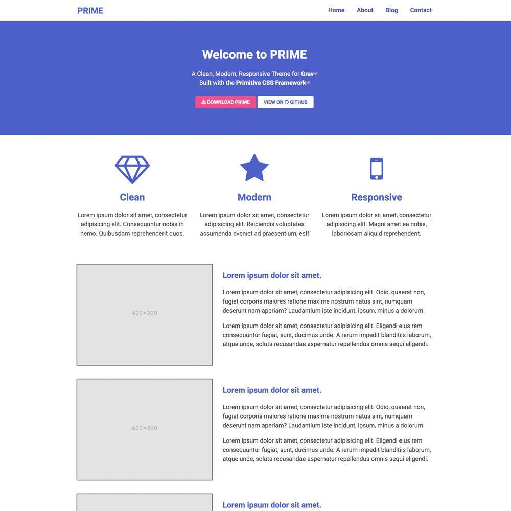

# PRIME



PRIME is a clean, modern, responsive theme for [Grav](http://getgrav.org).

# Installation

Installing the PRIME theme can be done in one of two ways. Our GPM (Grav Package Manager) installation method enables you to quickly and easily install the theme with a simple terminal command, while the manual method enables you to do so via a zip file. 

## GPM Installation (Preferred)

The simplest way to install this theme is via the [Grav Package Manager (GPM)](http://learn.getgrav.org/advanced/grav-gpm) through your system's Terminal (also called the command line).  From the root of your Grav install type:

    bin/gpm install prime

This will install the PRIME theme into your `/user/themes` directory within Grav. Its files can be found under `/your/site/grav/user/themes/prime`.

## Manual Installation

To install this theme, just download the zip version of this repository and unzip it under `/your/site/grav/user/themes`. Then, rename the folder to `prime`. You can find these files either on [GitHub](https://github.com/collindaugherty/grav-theme-prime) or via [GetGrav.org](http://getgrav.org/downloads/themes).

You should now have all the theme files under

    /your/site/grav/user/themes/prime

>> NOTE: This theme is a modular component for Grav which requires the [Grav](http://github.com/getgrav/grav), [Error](https://github.com/getgrav/grav-theme-error) and [Problems](https://github.com/getgrav/grav-plugin-problems) plugins.

# Updating

As development for the PRIME theme continues, new versions may become available that add additional features and functionality, improve compatibility with newer Grav releases, and generally provide a better user experience. Updating PRIME is easy, and can be done through Grav's GPM system, as well as manually.

## GPM Update (Preferred)

The simplest way to update this theme is via the [Grav Package Manager (GPM)](http://learn.getgrav.org/advanced/grav-gpm). You can do this with this by navigating to the root directory of your Grav install using your system's Terminal (also called command line) and typing the following:

    bin/gpm update prime

This command will check your Grav install to see if your PRIME theme is due for an update. If a newer release is found, you will be asked whether or not you wish to update. To continue, type `y` and hit enter. The theme will automatically update and clear Grav's cache.

## Manual Update

Manually updating PRIME is pretty simple. Here is what you will need to do to get this done:

* Delete the `your/site/user/themes/prime` directory.
* Download the new version of the PRIME theme from either [GitHub](https://github.com/collindaugherty/grav-plugin-prime) or [GetGrav.org](http://getgrav.org/downloads/themes#extras).
* Unzip the zip file in `your/site/user/themes` and rename the resulting folder to `prime`.
* Clear the Grav cache. The simplest way to do this is by going to the root Grav directory in terminal and typing `bin/grav clear-cache`.

> Note: Any changes you have made to any of the files listed under this directory will also be removed and replaced by the new set. Any files located elsewhere (for example a YAML settings file placed in `user/config/themes`) will remain intact.

## Features

* Lightweight and minimal for optimal performance
* SCSS based CSS source files for easy customization
* Multiple page template types
* Fontawesome icon support

### Supported Page Templates

* Default view template
* Blog view template
* Blog item view template
* Modular view templates:

##### Menu Text & Icons

Each page shows up in the menu using the title by default, however you can set what displays in the menu directly by setting an explicit `menu:` option in the page header:

```
menu: My Menu
```

You can also provide an icon to show up in front of the menu item by providing an `icon:` option.  You need to use name of the FontAwesome icon without the `fa-` prefix.  Check out the full [list of current FontAwesome 4.2 icons](http://fortawesome.github.io/Font-Awesome/icons/):

```
icon: bar-chart-o
```

#### Custom Menu Items

By default, Grav generates the menu from the page structure.  However, there are times when you may want to add custom menu items to the end of the menu.  This is now supported in PRIME by creating a menu list in your `site.yaml` file.  An example of this is as follows:

```
menu:
    - text: Source
      url: https://github.com/getgrav/grav
    - icon: twitter
      url: http://twitter.com/getgrav
```

The `url:` option is required, but you can provide **either** or **both** `text:` and/or `icon:`

# Setup

If you want to set PRIME as the default theme, you can do so by following these steps:

* Navigate to `/your/site/grav/user/config`.
* Open the **system.yaml** file.
* Change the `theme:` setting to `theme: prime`.
* Save your changes.
* Clear the Grav cache. The simplest way to do this is by going to the root Grav directory in Terminal and typing `bin/grav clear-cache`.

Once this is done, you should be able to see the new theme on the frontend. Keep in mind any customizations made to the previous theme will not be reflected as all of the theme and templating information is now being pulled from the **PRIME** folder.
